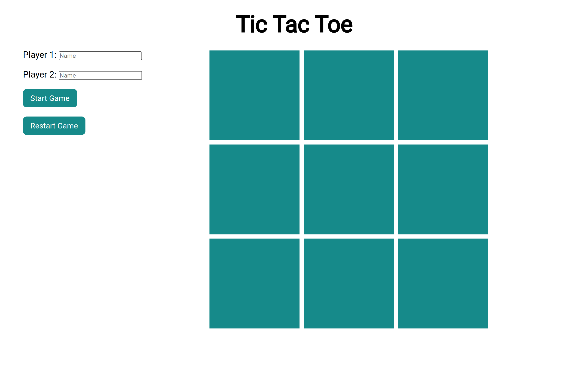

# tic-tac-toe

:point_right: [live demo](https://cmfernandes.github.io/tic-tac-toe/) 

---

## About

This project is a simple Tic Tac Toe game.

The main purpose of this project was to practice:
- Factory functions
- Module pattern
- DOM manipulation

Assigment from [The Odin Project](https://www.theodinproject.com/lessons/node-path-javascript-tic-tac-toe) Javascript course. 